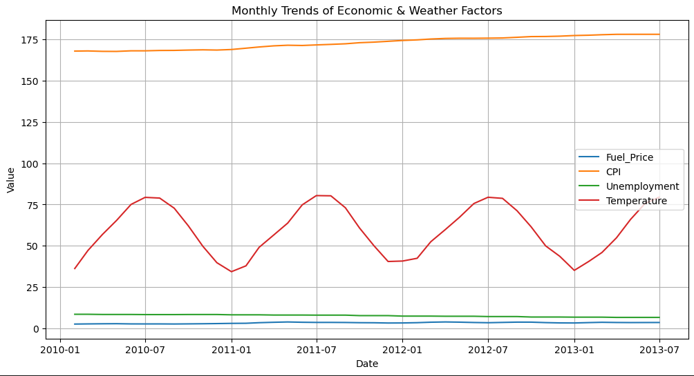

# 🛒 Walmart Retail Sales – Time Series Breakdown  

## 📌 Project Overview  
This project focuses on **time series analysis of Walmart’s retail dataset**, with an emphasis on understanding **economic and seasonal factors** (Fuel Price, CPI, Unemployment, Temperature, and MarkDowns). The goal was to uncover **long-term trends, seasonal cycles, and forecast future behavior** using Python-based time series techniques.  

By completing this project, I gained hands-on experience in:  
- Data cleaning & preprocessing  
- Time series trend & seasonality analysis  
- Time series decomposition  
- Rolling averages & smoothing  
- Forecasting with Exponential Smoothing (ETS)  
- Data visualization using Matplotlib  

---

## 📂 Dataset  
- **Source**: Walmart Sales Forecasting (Kaggle)  
- **File Used**: `features.csv`  
- **Key Columns**:  
  - `Store` – Store ID  
  - `Date` – Week start date  
  - `IsHoliday` – Whether the week was a holiday or not  
  - `Temperature` – Regional temperature  
  - `Fuel_Price` – Fuel price in the region  
  - `CPI` – Consumer Price Index  
  - `Unemployment` – Unemployment rate  
  - `MarkDown1–5` – Promotional markdown data  

---

## 🛠️ Tools & Libraries  
- **Python**  
- **Pandas** → Data cleaning & manipulation  
- **Matplotlib** → Visualization  
- **Statsmodels** → Time series decomposition & forecasting  

---

## 📊 Steps & Analysis  

### 🟢 Step 1: Data Preprocessing  
- Converted dates into datetime format  
- Handled missing values (`MarkDown` → 0, others filled using forward/backward fill)  
- Fixed datatypes (Store as category, IsHoliday as boolean)  
- Created new time features: Year, Month, YearMonth, MonthName  
- Built **TotalMarkDown** feature by combining markdown columns  

### 🟢 Step 2: Trend Analysis  
- Aggregated features to monthly level  
- Observed long-term movements in Fuel Price, CPI, Unemployment, and Temperature  

### 🟢 Step 3: Moving Averages  
- Applied 3-month, 6-month, and 12-month rolling averages  
- Compared smoothed curves against raw data to identify trends  

### 🟢 Step 4: Seasonal Patterns  
- Extracted month names for all records  
- Plotted average values by month across years  
- Found **Temperature** to be highly seasonal, while CPI and Unemployment showed weaker cycles  

### 🟢 Step 5: Time Series Decomposition  
- Used `seasonal_decompose` to separate each variable into:  
  - **Trend** → long-term direction  
  - **Seasonality** → repeating yearly cycles  
  - **Residuals** → random fluctuations  

### 🟢 Step 6: Revenue / MarkDown Breakdown  
- Summed up markdowns to analyze total promotions over time  
- Compared markdown intensity by store and across months  

### 🟢 Step 7 (Bonus): Forecasting  
- Applied **Exponential Smoothing (ETS)**  
- Forecasted next 12 months for selected variables  

---

## 🔑 Key Insights  
- **Temperature** shows the clearest seasonality (summer peaks, winter dips).  
- **CPI** rises steadily over time (inflation effect).  
- **Unemployment** trends downward, with mild seasonal signals.  
- **Fuel Prices** fluctuate but lack strong seasonality.  
- **Markdowns** are unevenly distributed across stores, highlighting targeted promotions.  

---

## 🏁 Conclusion  
This project demonstrates how **time series analysis** can uncover patterns in retail data and provide **actionable insights**:  

- Seasonality helps align promotions with demand cycles.  
- Trend analysis highlights the impact of economic conditions.  
- Decomposition makes it easier to separate noise from meaningful signals.  
- Simple forecasting (ETS) provides interpretable projections for future planning.  

📌 These techniques are valuable for **retail demand forecasting, sales strategy, and inventory management**.  

---

## 📷 Project Visuals  
(You can add plots here, e.g., seasonal trends, decomposition, and forecasts. Place them in a `Pics/` folder and reference them like below.)  

  
  

---

## 🚀 How to Run the Project  
1. Clone this repository https://github.com/AsharAftab20056/Walmart-Retail-Sales  
2. Install dependencies:  
   ```bash
   pip install pandas matplotlib statsmodels

3. Run the Jupyter Notebook / Python scripts step by step
4. Explore the plots and insights

## 📬 Author  
**Ashar Aftab**  
📧 Email: [asharaftab2004@gmail.com](mailto:asharaftab2004@gmail.com)  
🔗 LinkedIn: www.linkedin.com/in/ashar-aftab-b09924295

---

## 📜 License  
This project is free for educational and non-commercial use.  
Feel free to fork, improve, and give credit where due.

---

> If you found this project useful or insightful, consider giving it a ⭐ on GitHub!

